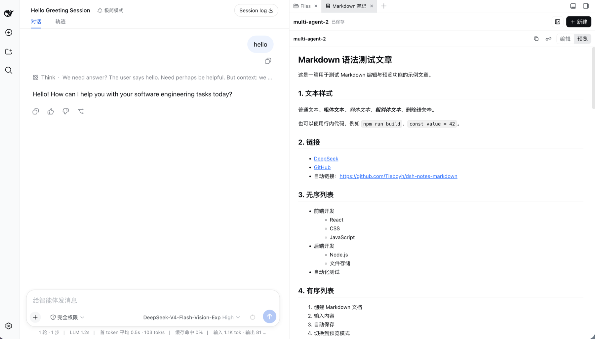
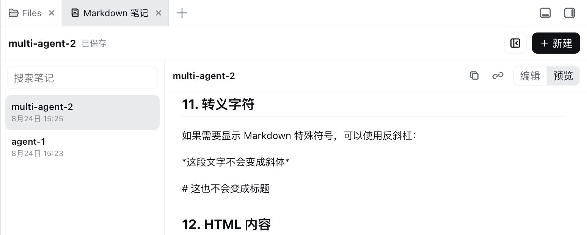
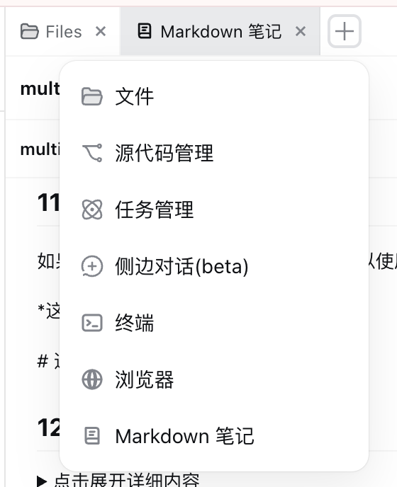
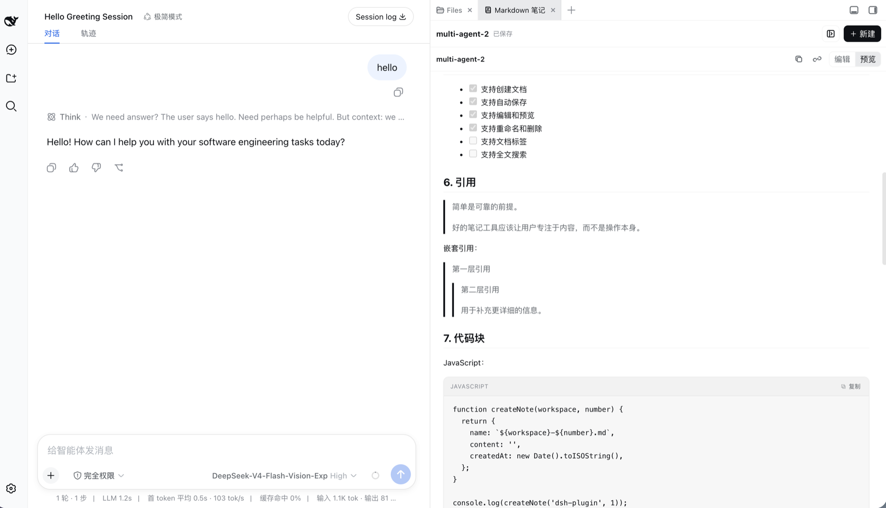
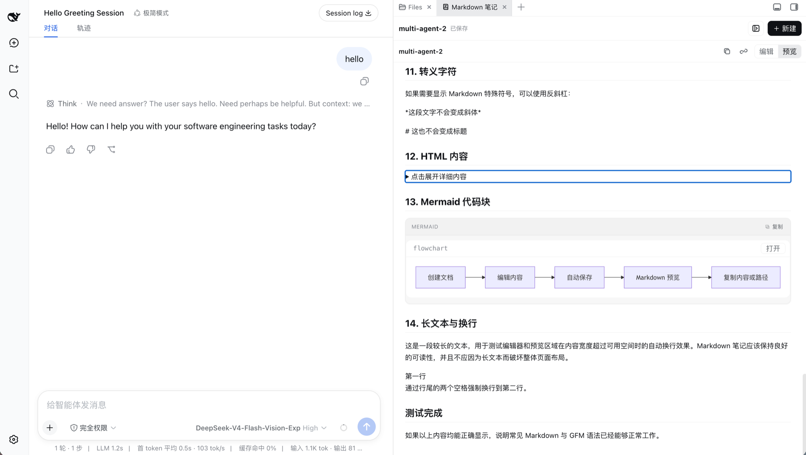

# dsh-notes-markdown

[English](./README.md) | [简体中文](./README.zh-CN.md)

在 DeepSeek Harness 侧边栏中快速记录和管理真实文件形式的 Markdown 笔记。

它不是只读文档面板：你可以直接在 DSH 内新建、实时编辑、查看 Markdown 源码、重命名、搜索、复制和删除文档。笔记默认保存为 `~/.dsh/docs` 下的真实 `.md` 文件。

## 为什么需要这个插件

想法、决策、实现细节和后续任务往往产生于 DSH 对话。**dsh-notes-markdown** 在对话旁提供一个轻量的沉淀空间，让重要结果不再埋在聊天记录中，也不需要切换到外部编辑器。

> 对话产生想法，笔记沉淀结果。

它的定位是专注的 Markdown 工作台，而不是复杂知识库：

- **边聊边记**：保持当前 DSH 对话可见，同时记录决策、方案、接口和任务。
- **保存真实文件**：每篇笔记都是普通的本地 `.md` 文件，可继续交给编辑器、Git、脚本和 Agent 使用。
- **保持工作流连贯**：一键创建、自动保存、实时编辑、源码查看、搜索、复制、重命名和删除，减少文档管理步骤。
- **通过路径协作**：复制笔记的绝对路径，直接交给同一环境中的 Agent 读取或修改。

典型用途包括技术方案、接口说明、开发清单、会议结论、可复用 Prompt、代码片段和 Mermaid 源码记录。

## 界面预览

<p align="center">
  
</p>
<p align="center"><sub>保持对话可见，同时记录和预览完整的 Markdown 文档。</sub></p>

### 专注的笔记工作流

<table>
  <tr>
    <td width="72%" valign="top">
      
      <br><sub>搜索、切换笔记或收起列表，让编辑区域保持专注。</sub>
    </td>
    <td width="28%" valign="top">
      
      <br><sub>随时从 Better Sidebar 打开 Markdown 笔记。</sub>
    </td>
  </tr>
</table>

### 丰富的 Markdown 渲染

<p align="center">
  
</p>
<p align="center"><sub>支持 GFM、嵌套引用、任务列表、语言标签代码卡片和单块复制。</sub></p>

<p align="center">
  
</p>
<p align="center"><sub>Mermaid 围栏代码块可与兼容的 DSH Mermaid 渲染增强协作显示。</sub></p>

## 功能

- 在 Better Sidebar 中注册常驻的「Markdown 笔记」页面
- 根据当前工作区名称和自动编号一键创建文档
- 在 Typora 风格的「实时编辑」和精确的「源码」模式间切换
- 打开、搜索、重命名和删除笔记；重命名与删除集中在笔记右键菜单
- 可折叠笔记列表，并记住上次展开状态
- 停止输入后自动保存，并显示保存状态
- 实时编辑支持标题、链接、列表、任务列表、引用、表格和围栏代码块等 GFM 内容
- 对需要精确控制或尚未支持的扩展语法，仍可随时切换源码模式
- 一键复制当前 Markdown 内容或文档绝对路径
- 使用 revision 拒绝其他 DSH 窗口产生的过期写入
- 原子保存、重名保护、路径穿越保护和符号链接拒绝
- 跟随页面语言显示中文或英文
- 适配不同宽度的侧边栏布局

## 安装

如果尚未安装 Better Sidebar，先执行：

```sh
dsh plugin --profile web add dsh-better-sidebar
```

然后安装本插件：

```sh
dsh plugin --profile web add github:Tieboyh/dsh-notes-markdown
```

仓库包含预构建插件 bundle，通过 GitHub 安装时不需要额外授权依赖构建。

安装、升级或卸载插件后需要重启 DSH Web。之后可从 Better Sidebar 的 `+` 菜单打开「Markdown 笔记」。

## 数据位置

笔记是普通 Markdown 文件，默认保存在：

```text
~/.dsh/docs
```

目录会自动创建。如需使用其他目录，可以在启动 DSH Web 前设置 `DSH_NOTES_MARKDOWN_DIR`。

第一版有意只支持单层文档目录。文档名称不能包含 `/`、`\\`、隐藏文件前缀或路径穿越片段。

## 保存机制

停止输入约 700 毫秒后自动保存。切换或重命名文档前会先落盘待保存内容。每次写入都会携带读取时的 revision；如果另一个窗口已经修改文件，插件会提示冲突，不会覆盖更新内容。

## 本地开发

```sh
npm install
npm run check
npm run build
dsh plugin --profile web add "$PWD"
```

挂载本地源码后需要重启 DSH Web。

## 许可证

MIT
